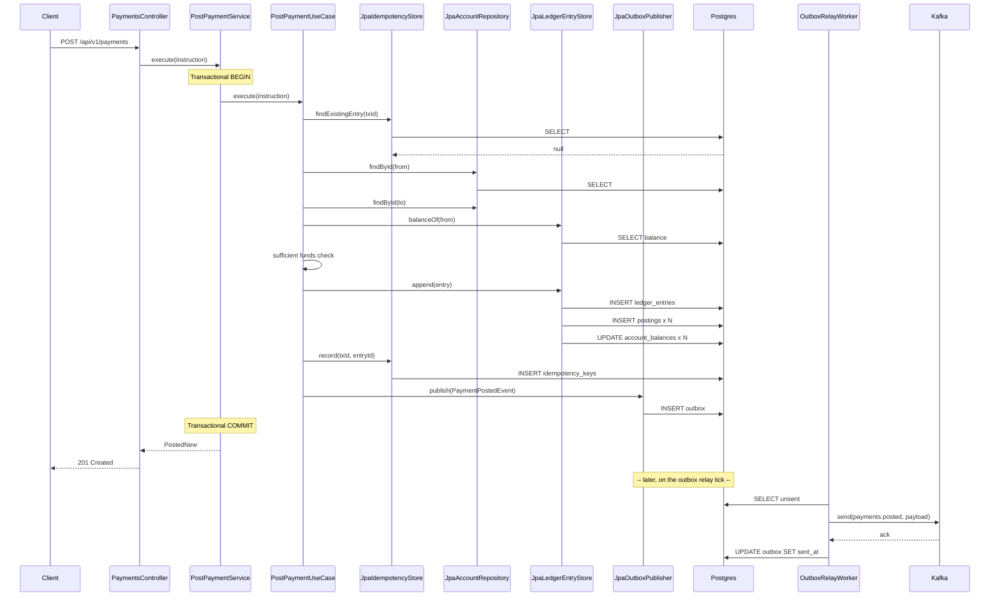
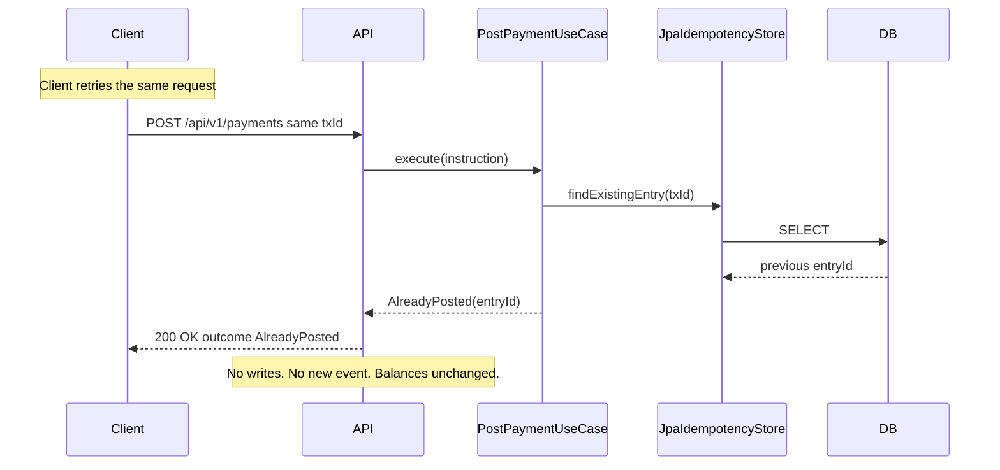

# Architecture notes

## Layer responsibilities

**Domain** (`ledger-domain`) — the framework-free core. Value objects, entities, event records, service interfaces (ports). Zero NuGet-equivalent — the module has only SLF4J API for logging on its compile classpath. Cannot import Spring, JPA, Jackson, or Kafka. Enforced by Gradle module boundaries.

**Application** (`ledger-application`) — use cases over the Domain interfaces. `PostPaymentUseCase`, `CreateAccountUseCase`, `GetAccountBalanceUseCase`. Sealed `PostPaymentResult` for the three-way outcome. Depends only on Domain. Testable end-to-end with in-memory fakes — no Postgres, no Kafka, sub-second test suite.

**Infrastructure** (`ledger-infrastructure`) — the persistence + messaging plumbing. JPA entities + Spring Data repositories + adapters implementing every Domain port. Flyway migration. Outbox table with JSONB payloads. Spring `@Configuration` classes wire everything up. Kafka consumer + producer + relay worker. Postgres in this module; the domain has never heard of it.

**App** (`ledger-app`) — the runnable Spring Boot host. REST controllers. Composition + wire-up only. Tiny code footprint — the interesting logic lives one layer down.

## Payment posting flow

## Idempotent redelivery

## Why an outbox instead of publishing directly to Kafka?

The naive approach — publish to Kafka in the same code path that writes to Postgres — has a **dual-write inconsistency** problem. If we write to the DB and then publish to Kafka, a crash between them leaves us with a DB row and no event. If we publish to Kafka first and then write to the DB, a crash between them leaves us with an event about a payment that never happened.

The outbox pattern solves this by making the Kafka publication a **separate, later step**. The write path only touches the DB (ledger entry + outbox row, one transaction, atomic). A separate worker reads the outbox and publishes. If the worker crashes between publishing and marking sent, the row stays unsent and the next tick re-publishes — **at-least-once** delivery. Consumers must be idempotent, which they are (deduping on the event's stable UUID).

The trade-off: one extra hop, a few seconds of latency between DB commit and Kafka publication. For a payments service that's a great trade — never lose an event, never invent an event.

## Why a balance projection instead of computing balance on read?

Two reasons:

1. **Performance.** A large account with 10 million postings would need to sum them all on every balance read. The projection is O(1). We pay a small write cost per posting (one UPDATE on the balance row) for a large read cost saving.
2. **Locking**. The `SELECT ... FOR UPDATE` on the balance row is what serialises concurrent posters on the same account. Two payments hitting the same account in the same millisecond queue up on the row lock; they can't both read the "old" balance and both write half-updates. Without the projection there's nothing to lock at row granularity.

The risk: the projection can drift from the underlying postings if there's a bug. Mitigation: a nightly reconciliation job SUMs the postings and compares against the projection, alerting on any discrepancy. Not in the demo; is in the roadmap.

## Why sealed types for events and results?

`sealed interface DomainEvent permits AccountCreatedEvent, PaymentPostedEvent, PaymentFailedEvent {}` gives us **exhaustive switch** in the outbox relay's `topicFor()` method. If a new event type is added and the switch isn't updated, the compiler flags it. That prevents "we added a new event but forgot to route it" bugs.

Same story for `PostPaymentResult`. Callers must handle all three cases; a new case forces every caller to handle it.

## What's deliberately not in the demo

- **Multi-currency FX**. Every posting must be in one currency; a hedged forex booking would need a domain-level currency-conversion service. Interesting but out of scope.
- **Real payment rail integration**. No Faster Payments, no BACS, no SEPA, no SWIFT. The inbound `payments.submitted` topic is where a real integration would drop messages.
- **Kafka Streams / KSQL**. The outbox relay is a simple polling worker. In a high-throughput deployment I'd swap for Debezium change-data-capture off the outbox table.
- **Distributed locking on the retention or relay workers**. Single-node deployment. Multi-node would need a Postgres advisory lock or Redis SET NX fence.
- **Audit trail beyond the ledger entries themselves**. Every payment is auditable via its ledger entry + posting rows, but there's no separate compliance audit table. That would be trivial to add via the outbox pattern too.
